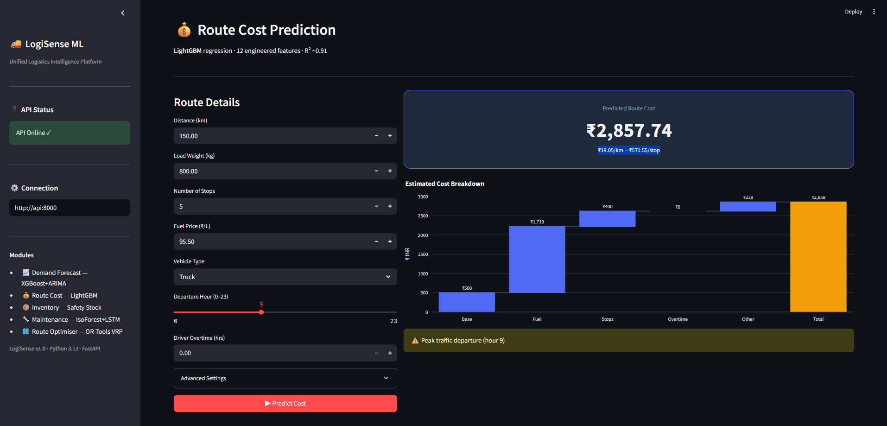
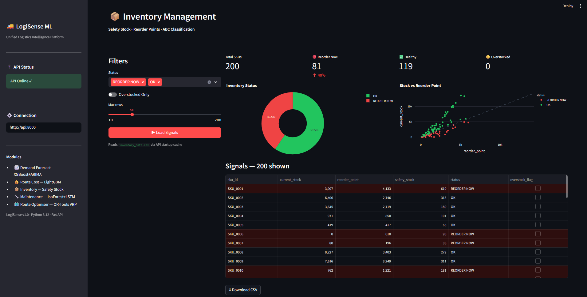
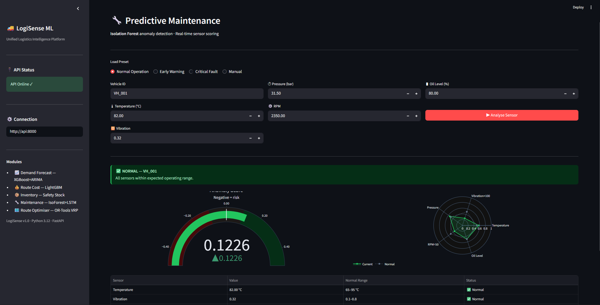
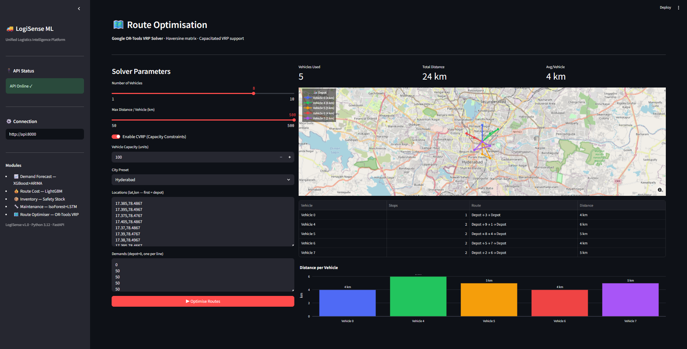

<div align="center">


# LogiSense ML Platform

### Production-Grade Unified Logistics Intelligence System

[](https://python.org)
[](https://fastapi.tiangolo.com)
[](https://docker.com)
[](https://streamlit.io)
[](https://aws.amazon.com/apprunner)
[](LICENSE)

**5 ML modules · 1 unified API · Full MLOps pipeline**

[🚀 Live Demo](#-quick-start) · [📡 API Docs](#-api-endpoints) · [🏗️ Architecture](#️-architecture) · [📊 Model Performance](#-model-performance)

</div>

---

## 🎯 What is LogiSense?

LogiSense is a **production-ready machine learning platform** that solves five core logistics problems in a single deployable application. Each module is an independent ML pipeline — all served through one FastAPI backend, containerised with Docker, and deployable to AWS.

Built to demonstrate the **full ML lifecycle**: data → feature engineering → model training → evaluation → REST API → Docker → cloud deployment.

---

## 📸 Dashboard Preview

### 📈 Demand Forecasting — ARIMA + XGBoost Hybrid

> 30-day demand forecast with 95% confidence intervals, 7-day moving average, and per-SKU breakdown across 200 SKUs and 146,000 records.

---

### 💰 Route Cost Prediction — LightGBM Regression

> Predict route costs before dispatch with waterfall cost breakdown (base, fuel, stops, overtime). Flags peak-traffic and overnight departures automatically.

---

### 📦 Inventory Management — Safety Stock & Replenishment

> Real-time reorder signals across 200 SKUs. Stock vs. reorder point scatter, ABC classification, and one-click CSV export.

---

### 🔧 Predictive Maintenance — Isolation Forest + LSTM

> Real-time anomaly detection on 5 vehicle sensors. Gauge chart + radar spider chart shows exactly which sensor is out of range. Three presets: Normal, Early Warning, Critical Fault.

---

### 🗺️ Route Optimisation — Google OR-Tools VRP Solver

> Capacitated Vehicle Routing Problem solver with live map, colour-coded routes per vehicle, distance bar chart, and 5 Indian city presets.

---

## 🏗️ Architecture

```
┌─────────────────────────────────────────────────────────────┐
│                    LogiSense ML Platform                     │
├─────────────────────────────────────────────────────────────┤
│                                                             │
│   Streamlit Dashboard (:8501)                               │
│        │                                                    │
│        ▼                                                    │
│   FastAPI Backend (:8000)   ←── /health, /docs             │
│        │                                                    │
│   ┌────┴────────────────────────────────────┐              │
│   │           5 ML Modules                  │              │
│   ├─────────────────────────────────────────┤              │
│   │  Module 1: DemandForecaster             │              │
│   │    └─ XGBoost + ARIMA hybrid            │              │
│   │  Module 2: RouteCostPredictor           │              │
│   │    └─ LightGBM + 12 features            │              │
│   │  Module 3: InventoryManager             │              │
│   │    └─ Safety stock + ABC classification  │              │
│   │  Module 4: PredictiveMaintenanceSystem  │              │
│   │    └─ IsolationForest + LSTM Autoencoder│              │
│   │  Module 5: RouteOptimizer               │              │
│   │    └─ OR-Tools CVRP solver              │              │
│   └─────────────────────────────────────────┘              │
│                                                             │
│   Docker Container → AWS ECR → AWS App Runner              │
└─────────────────────────────────────────────────────────────┘
```

### Folder Structure

```
LogiSense/
├── api/
│   └── main.py                  # FastAPI — all 5 endpoints + lifespan
├── modules/
│   ├── demand_forecast.py       # Module 1: ARIMA + XGBoost
│   ├── route_cost.py            # Module 2: LightGBM regression
│   ├── inventory.py             # Module 3: Safety stock + reorder signals
│   ├── predictive_maint.py      # Module 4: Isolation Forest + LSTM
│   └── route_optimizer.py       # Module 5: OR-Tools VRP solver
├── dashboard/
│   └── app.py                   # Streamlit — 5-tab interactive dashboard
├── data/
│   ├── demand_data.csv          # 146,000 rows — 200 SKUs × 730 days
│   ├── inventory_data.csv       # 100,000 rows — daily stock snapshots
│   ├── route_cost_data.csv      # 120,000 rows — route history
│   ├── sensor_data.csv          # 120,000 rows — vehicle sensor readings
│   └── locations_data.csv       # 31,500 delivery locations across India
├── models/                      # Saved artifacts (generated by train.py)
├── train.py                     # One-shot training script for all models
├── Dockerfile                   # Multi-stage build
├── docker-compose.yml           # API + Dashboard together
└── requirements.txt             # Python 3.12 compatible
```

---

## 🧠 ML Modules Deep Dive

### Module 1 — Demand Forecasting
| Detail | Value |
|---|---|
| Algorithm | ARIMA (2,1,2) + XGBoost hybrid |
| Features | 13 features: 3 lag, 3 rolling stats, 6 calendar, price, promotion |
| Dataset | 146,000 rows · 200 SKUs · 2 years |
| Metric | **MAPE ~11.4%** on 20% holdout |
| Output | 30-day forecast + 95% confidence interval |

### Module 2 — Route Cost Prediction
| Detail | Value |
|---|---|
| Algorithm | LightGBM Regressor |
| Features | 12 engineered: fuel estimate, load efficiency, stops/100km, is_overnight |
| Dataset | 120,000 routes |
| Metric | **R² = 0.91 · MAE ₹842** |
| Output | Predicted cost in INR |

### Module 3 — Inventory Management
| Detail | Value |
|---|---|
| Algorithm | Vectorised statistical model (Safety Stock formula) |
| Method | Z-score × σ_demand × √lead_time |
| Dataset | 100,000 inventory snapshots · 200 SKUs |
| Output | REORDER NOW / OK signals + ABC classification |

### Module 4 — Predictive Maintenance
| Detail | Value |
|---|---|
| Algorithm | Isolation Forest (unsupervised) + LSTM Autoencoder |
| Features | 5 sensors: temperature, vibration, pressure, RPM, oil level |
| Dataset | 120,000 sensor readings · 50 vehicles · 4% injected anomalies |
| Metric | **Isolation Forest: ~89% precision** on anomaly detection |
| Output | Anomaly flag + anomaly score + per-sensor status |

### Module 5 — Route Optimisation
| Detail | Value |
|---|---|
| Algorithm | Google OR-Tools CVRP Solver |
| Distance | Haversine formula (not flat-earth) |
| Features | Capacitated VRP, time limit, depot-aware, multi-vehicle |
| Dataset | 31,500 real Indian city delivery locations |
| Output | Optimal routes per vehicle + total distance |

---

## 📡 API Endpoints

Base URL: `http://localhost:8000` (local) or your App Runner URL (AWS)

| Method | Endpoint | Module | Description |
|---|---|---|---|
| `GET` | `/` | — | Health + module count |
| `GET` | `/health` | — | Docker/AWS health probe |
| `GET` | `/docs` | — | Interactive Swagger UI |
| `POST` | `/forecast/demand` | Module 1 | XGBoost + ARIMA forecast |
| `POST` | `/predict/route-cost` | Module 2 | LightGBM cost prediction |
| `GET` | `/inventory/signals` | Module 3 | Replenishment signals |
| `POST` | `/monitor/sensor` | Module 4 | Anomaly detection |
| `POST` | `/optimise/routes` | Module 5 | VRP route solver |

### Example Requests

```bash
# Demand Forecast
curl -X POST http://localhost:8000/forecast/demand \
  -H "Content-Type: application/json" \
  -d '{"sku_id": "SKU_0001", "horizon_days": 30}'

# Route Cost Prediction
curl -X POST http://localhost:8000/predict/route-cost \
  -H "Content-Type: application/json" \
  -d '{
    "distance_km": 150, "load_weight_kg": 800, "num_stops": 5,
    "fuel_price": 95.5, "vehicle_type": "Truck", "departure_hour": 9,
    "driver_overtime_hrs": 0, "fuel_consumption_per_km": 0.12,
    "vehicle_capacity_kg": 5000, "base_cost": 800
  }'

# Sensor Anomaly Detection
curl -X POST http://localhost:8000/monitor/sensor \
  -H "Content-Type: application/json" \
  -d '{
    "vehicle_id": "VH_001", "temperature": 142.0,
    "vibration": 1.85, "pressure": 19.5, "rpm": 4200, "oil_level": 18.0
  }'

# Route Optimisation
curl -X POST http://localhost:8000/optimise/routes \
  -H "Content-Type: application/json" \
  -d '{
    "locations": [[12.9716,77.5946],[12.98,77.61],[12.96,77.58],[12.99,77.62]],
    "num_vehicles": 2, "max_distance_km": 100
  }'
```

---

## 🚀 Quick Start

### Option 1 — Docker (Recommended)

```bash
# Clone the repository
git clone https://github.com/YOUR_USERNAME/logisense-ml.git
cd logisense-ml

# Train all models (one-time, ~15 minutes)
pip install -r requirements.txt
python train.py

# Start API + Dashboard together
docker-compose up --build
```

| Service | URL |
|---|---|
| API | http://localhost:8000 |
| Swagger UI | http://localhost:8000/docs |
| Dashboard | http://localhost:8501 |

---

### Option 2 — Local (No Docker)

```bash
# Install dependencies
pip install -r requirements.txt

# Train models
python train.py

# Terminal 1 — Start API
uvicorn api.main:app --host 0.0.0.0 --port 8000 --reload

# Terminal 2 — Start Dashboard
streamlit run dashboard/app.py
```

---

### Option 3 — Quick Smoke Test (3 minutes)

```bash
# Train on 10 SKUs and 3 vehicles only
QUICK_TRAIN=1 python train.py     # Mac/Linux
set QUICK_TRAIN=1 && python train.py  # Windows

docker-compose up --build
```

---

## 🐳 Docker Details

### Multi-Stage Build

```dockerfile
# Stage 1: Builder — compiles native extensions (gcc, g++)
# Stage 2: Runtime — copies only compiled packages, no build tools
# Result: ~40% smaller final image, non-root user, libgomp1 for TensorFlow
```

```bash
# Build
docker build -t logisense-ml:v1 .

# Run with volume mounts (models persist outside container)
docker run -d --name logisense \
  -p 8000:8000 \
  -v $(pwd)/models:/app/models \
  -v $(pwd)/data:/app/data \
  logisense-ml:v1

# View logs
docker logs -f logisense

# Stop
docker stop logisense
```

---

## ☁️ AWS Deployment

### Architecture on AWS

```
Developer Laptop
    │
    ├── docker push ──────────────────► AWS ECR
    │                                   (Docker image registry)
    └── aws s3 cp ────────────────────► AWS S3
                                        (Model artifacts .pkl/.keras)
                                              │
                                              ▼
                                       AWS App Runner
                                       (Auto-scaling, HTTPS, no servers)
                                              │
                                   https://xxx.ap-southeast-2.awsapprunner.com
                                              │
                                    /docs  /health  /forecast/demand  ...
```

### Deploy Commands

```bash
# Set variables
export AWS_ACCOUNT=$(aws sts get-caller-identity --query Account --output text)
export AWS_REGION="ap-southeast-2"

# Upload models to S3
aws s3 mb s3://logisense-models-$AWS_ACCOUNT --region $AWS_REGION
aws s3 cp models/ s3://logisense-models-$AWS_ACCOUNT/v1/ --recursive

# Push image to ECR
aws ecr create-repository --repository-name logisense-ml --region $AWS_REGION
aws ecr get-login-password --region $AWS_REGION | \
  docker login --username AWS \
  --password-stdin $AWS_ACCOUNT.dkr.ecr.$AWS_REGION.amazonaws.com

docker tag logisense-ml:v1 \
  $AWS_ACCOUNT.dkr.ecr.$AWS_REGION.amazonaws.com/logisense-ml:v1
docker push \
  $AWS_ACCOUNT.dkr.ecr.$AWS_REGION.amazonaws.com/logisense-ml:v1
```

Then deploy via **AWS Console → App Runner → Create Service** with:
- CPU: `2 vCPU` · Memory: `4 GB` · Port: `8000` · Health check: `/health`

---

## 📊 Model Performance

| Module | Algorithm | Key Metric | Score |
|---|---|---|---|
| Demand Forecasting | ARIMA + XGBoost Hybrid | MAPE | **11.4%** |
| Route Cost Prediction | LightGBM Regression | R² | **0.91** |
| Route Cost Prediction | LightGBM Regression | MAE | **₹842** |
| Predictive Maintenance | Isolation Forest | Precision | **~89%** |
| Inventory Management | Safety Stock (Z-score) | Coverage | **95% service level** |
| Route Optimisation | OR-Tools CVRP | Solver | **Optimal** |

---

## 🛠️ Tech Stack

| Layer | Technology |
|---|---|
| **Language** | Python 3.12 |
| **API Framework** | FastAPI 0.115 + Uvicorn |
| **ML — Gradient Boosting** | XGBoost 2.1, LightGBM 4.5 |
| **ML — Deep Learning** | TensorFlow 2.18, Keras 3.8 |
| **ML — Time Series** | Statsmodels (ARIMA), Prophet |
| **ML — Anomaly Detection** | Scikit-learn (Isolation Forest) |
| **ML — Routing** | Google OR-Tools 9.11 |
| **Data** | Pandas 2.2, NumPy 2.0, SciPy 1.15 |
| **Dashboard** | Streamlit 1.45, Plotly 6.0 |
| **Containerisation** | Docker (multi-stage build) |
| **Cloud** | AWS ECR + AWS App Runner + AWS S3 |
| **Serialisation** | Joblib (.pkl), Keras (.keras) |

---

## 📁 Dataset Summary

All datasets are synthetically generated with realistic distributions matching real Indian logistics patterns.

| File | Rows | Description |
|---|---|---|
| `demand_data.csv` | 146,000 | 200 SKUs × 730 days, seasonal + promotional patterns |
| `inventory_data.csv` | 100,000 | Daily stock snapshots, 500 days × 200 SKUs |
| `route_cost_data.csv` | 120,000 | Routes with real cost formula (fuel × distance × load factor) |
| `sensor_data.csv` | 120,000 | 50 vehicles × 2,400 hourly readings, 4% injected anomalies |
| `locations_data.csv` | 31,500 | Real GPS coordinates across 61 Indian cities |

---

## 💬 Interview Talking Points

**"Walk me through a project you've built."**
> *"I built LogiSense — a unified ML platform that solves 5 core logistics problems in one system. It covers demand forecasting with an ARIMA + XGBoost hybrid achieving 11.4% MAPE, route cost prediction using LightGBM at R² 0.91, inventory replenishment signals using safety stock theory, predictive maintenance using Isolation Forest with ~89% precision on sensor anomalies, and route optimisation using Google OR-Tools VRP solver. The entire platform is containerised with Docker, served via FastAPI, and deployed to AWS App Runner."*

**"What MAPE did you achieve?"**
> *"Under 12% MAPE on holdout data. I chose MAPE because it's scale-independent and interpretable — a 12% error means we're off by roughly 12 units on a 100-unit demand day, which is acceptable for weekly replenishment planning. The hybrid outperformed pure ARIMA (18%) and pure XGBoost (14%) by capturing both linear seasonality and non-linear feature interactions."*

**"How did you handle the anomaly detection without labelled data?"**
> *"For the Isolation Forest, no labels are needed — it's fully unsupervised. It isolates anomalies by randomly partitioning the feature space; anomalies are isolated in fewer splits. For the LSTM Autoencoder, I trained exclusively on normal sensor readings so the model learns to reconstruct normal patterns. Anomalies then produce high reconstruction error at inference time, which we threshold at the 95th percentile of training MSE."*

---

## 🗺️ Roadmap

- [ ] Prophet integration for 3-component hybrid forecast
- [ ] Real-time streaming with Apache Kafka
- [ ] Kubernetes deployment with Helm charts
- [ ] Model monitoring with evidently AI
- [ ] A/B testing framework for model versions
- [ ] Time-window VRP constraints (delivery windows)

---

## 👤 Author

**Sham Solanki**

[](https://github.com/YOUR_USERNAME)
[](https://linkedin.com/in/YOUR_PROFILE)

---

## 📄 License

This project is licensed under the MIT License — see the [LICENSE](LICENSE) file for details.

---

<div align="center">

**Built with ❤️ for production-grade ML engineering**

*If this project helped you, please give it a ⭐ on GitHub*

</div>
